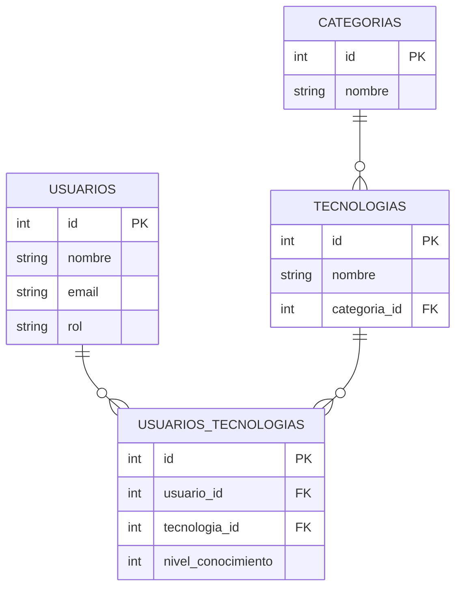

# Proyecto: Backend de Gestión del Conocimiento

## Descripción
Este proyecto fue desarrollado durante un hackathon por un equipo de 4 personas. Su propósito es gestionar el conocimiento de los empleados dentro de una empresa, permitiendo registrar qué tecnologías domina cada usuario, categorizarlas y facilitar el aprendizaje sobre ellas.

## Tecnologías Utilizadas
- Lenguaje: [Java]
- Framework: [Spring]
- Base de datos: [H2]

## Modelo de Datos
El sistema cuenta con cuatro tablas principales:
1. **Usuarios**: Representa a los empleados.
2. **Tecnologías**: Contiene información sobre las tecnologías registradas.
3. **Usuarios_Tecnologías**: Relaciona usuarios con las tecnologías que dominan.
4. **Categorías**: Clasifica las tecnologías en distintos grupos.



## Endpoints Principales
# API Documentation for Reto Gradiant

This document describes the available REST endpoints in the application.

## Documents Controller (`/documents`)

### Get Documents by Technology
- **Endpoint:** `GET /documents/byTechnology`
- **Parameters:**
    - `technology` (query parameter): Name of the technology
- **Response:** List of documents associated with the technology
- **Status Codes:**
    - 200: Success
    - 404: Technology not found

### Add Document
- **Endpoint:** `POST /documents/add`
- **Body:** DocumentDTO
  ```json
  {
    "name": "string",
    "url": "string",
    "technology": "string"
  }
  ```
- **Response:** Created document
- **Status Codes:**
    - 201: Created
    - 400: Invalid input
    - 409: Document already exists

## Category Controller (`/category`)

### Add Category
- **Endpoint:** `POST /category/add`
- **Body:**
  ```json
  {
    "name": "string"
  }
  ```
- **Response:** Created category
- **Status Codes:**
    - 201: Created
    - 400: Invalid input
    - 409: Category already exists

## User Controller (`/users`)

### Sign Up
- **Endpoint:** `POST /users/signup`
- **Body:**
  ```json
  {
    "password": "string",
    "name": "string",
    "email": "string",
    "role": "string"
  }
  ```
- **Response:** User information
- **Status Codes:**
    - 201: Created
    - 400: Invalid input
    - 409: User already exists

### Log In
- **Endpoint:** `POST /users/login`
- **Body:**
  ```json
  {
    "email": "string",
    "password": "string"
  }
  ```
- **Response:** User information
- **Status Codes:**
    - 200: Success
    - 400: Invalid credentials

## User Technologies Controller (`/searchs`)

### Search by Technologies
- **Endpoint:** `GET /searchs/byTechnologies`
- **Parameters:**
    - `name` (query parameter): Technology name
- **Response:** List of users with specified technology
- **Status Codes:**
    - 200: Success
    - 404: Technology not found

### Search by Users
- **Endpoint:** `GET /searchs/byUsers`
- **Parameters:**
    - `email` (query parameter): User email
- **Response:** List of technologies for specified user
- **Status Codes:**
    - 200: Success
    - 404: User not found

## Error Responses

All endpoints may return the following error status codes:
- 400: Bad Request
- 404: Not Found
- 409: Conflict
- 500: Internal Server Error

## Contribuidores
- Santiago Rey Garcia
- Alejandro Casal 
- Eloy Calvo Gens
- Pablo Ulloa Santín

## Licencia
MIT


